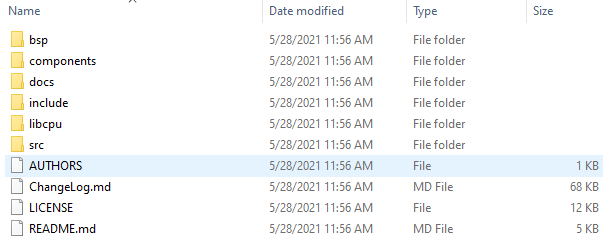
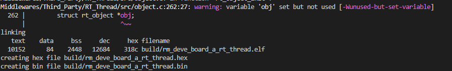
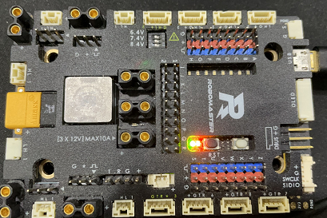
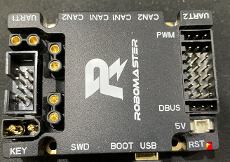

# rt-thread 移植到RoboMaster 开发板
## RT-Thread 简介
RT-Thread是一款主要由中国开源社区主导开发的开源实时操作系统; RT-Thread分为完整版和nano版本, 本项目主要移植nano版本(3.1.3).

[RT-Thread官网](https://www.rt-thread.org/)

[RT-Thread_3.1.3](https://www.rt-thread.org/download/nano/rt-thread-3.1.3.zip)
## 开发板简介
RoboMaster可购买到两种开发板：RoboMaster开发板 A型(简称A板)和RoboMaster开发板 C型(简称C板), 以下为官网介绍.本项目主要使用开发板上的led灯; A板为PF14绿灯, PE11红灯; C板为PH10，PH11，PH12(TIM5 CH1 CH2 CH3).

[RoboMaster开发板A型](https://www.robomaster.com/zh-CN/products/components/general/development-board)

[RoboMaster开发板C型](https://www.robomaster.com/zh-CN/products/components/general/development-board-type-c/info)

[RoboMaster开发板A型原理图](doc/schematic/A板/RoboMaster%20开发板A型%20原理图.pdf)

[RoboMaster开发板C型原理图](doc/schematic/C板/RoBoMaster%20开发板%20C%20型原理图.pdf)

## cubeMX
使用stm32CubeMX生成代码.

cubeMX版本：6.2.1

F4 package版本： 1.26.1

Toolchain/IDE: makefile

arm-none-eabi-gcc: 9.3.1

make版本: 4.2

关于如何使用Makefile和arm-none-eabi-gcc的环境配置参考 [stm32makefile](doc/readme/arm_none_eabi_gcc.md)

在RT-Thread官网文档[<基于 CubeMX 移植 RT-Thread Nano>](https://www.rt-thread.org/document/site/#/rt-thread-version/rt-thread-nano/nano-port-cube/an0041-nano-port-cube)中介绍如何在cubeMX中安装RT-Thread包生成代码, 也通过cubeMX安装RT-Thread包， 再通过cubeMX进行生成代码 这样也比较方便。

如需要手动移植nano版本的RT-Thread，也需要需要按照上面的官网文档中《中断与异常处理》, 去掉生成HardFault_Handler、PendSV_Handler、SysTick_Handler 中断函数.

## 文件移植

将下载的RT-Thread压缩包解压，解压后的文件目录如下:

将components, include, src文件夹复制到工程目录下 Middlewares/Third_Party/RT_Thread;

将bsp下的board.c, rtconfig.h文件复制到工程目录 RT_Thread下;

根据自身的CPU类型, 在libcpu选择对应的文件。 A板和C板均为arm/cortex-m4 复制到Middlewares/Third_Party/RT_Thread/libcpu中.

## makefile 修改

### C文件添加
在C_SOURCES变量中添加如下C文件。
~~~
RT_Thread/board.c \
Middlewares/Third_Party/RT_Thread/src/clock.c \
Middlewares/Third_Party/RT_Thread/src/components.c \
Middlewares/Third_Party/RT_Thread/src/idle.c \
Middlewares/Third_Party/RT_Thread/src/ipc.c \
Middlewares/Third_Party/RT_Thread/src/irq.c \
Middlewares/Third_Party/RT_Thread/src/kservice.c \
Middlewares/Third_Party/RT_Thread/src/mem.c \
Middlewares/Third_Party/RT_Thread/src/scheduler.c \
Middlewares/Third_Party/RT_Thread/src/thread.c \
Middlewares/Third_Party/RT_Thread/src/timer.c \
Middlewares/Third_Party/RT_Thread/src/object.c \
Middlewares/Third_Party/RT_Thread/libcpu/arm/cortex-m4/cpuport.c \
~~~
### s文件添加
在RT_THREAD_ASM_SOURCES变量中添加S文件。
~~~
ASM_SOURCES =  \
startup_stm32f427xx.s
RT_THREAD_ASM_SOURCES = Middlewares/Third_Party/RT_Thread/libcpu/arm/cortex-m4/context_gcc.S
~~~
### include路径
在C_INCLUDES变量中添加路径。
~~~
-IRT_Thread \
-IMiddlewares/Third_Party/RT_Thread/include \
~~~
### ASFLAGS
在ASFLASH中添加-Wa,-mimplicit-it=thumb.

~~~
ASFLAGS = $(MCU) $(AS_DEFS) $(AS_INCLUDES) $(OPT) -Wall -fdata-sections -ffunction-sections -Wa,-mimplicit-it=thumb
~~~

### OBJECTS 增加S文件
仿写已有的写法 将S文件添加到编译文件中
~~~
OBJECTS += $(addprefix $(BUILD_DIR)/,$(notdir $(RT_THREAD_ASM_SOURCES:.S=.o)))
vpath %.S $(sort $(dir $(RT_THREAD_ASM_SOURCES)))
~~~

### s文件编译规则修改
s文件编译选项中 cubemx生成的是使用CFLASG 将其修改为 ASFLAGS 并添加S文件编译规则
~~~
$(BUILD_DIR)/%.o: %.s Makefile | $(BUILD_DIR)
	@echo assembling $@
	@$(AS) -c $(ASFLAGS) $< -o $@

$(BUILD_DIR)/%.o: %.S Makefile | $(BUILD_DIR)
	@echo assembling $@
	@$(AS) -c $(ASFLAGS) $< -o $@
~~~
### S文件修改
在A板的startup_stm32f427xx.s和C板的startup_stm32f407xx.s中 第100行中将main修改为entry.

修改前
~~~
/* Call the clock system intitialization function.*/
  bl  SystemInit
/* Call static constructors */
    bl __libc_init_array
/* Call the application's entry point.*/
  bl  main
  bx  lr
~~~
修改后
~~~
/* Call the clock system intitialization function.*/
  bl  SystemInit
/* Call static constructors */
    bl __libc_init_array
/* Call the application's entry point.*/
  bl  entry
  bx  lr
~~~

### main 函数闪烁led

启动文件先运行SystemInit函数后再运行entry函数 而entry已经开启了rt-thread 并且将main函数作为任务启动。 故而运行到main函数已经是一个任务了， 在main函数中添加闪烁led功能。

A板
~~~
        HAL_GPIO_TogglePin(LED_GREEN_GPIO_Port, LED_GREEN_Pin);
        HAL_GPIO_TogglePin(LED_RED_GPIO_Port, LED_RED_Pin);
        rt_thread_mdelay(500);
~~~

C板 其中需要TIM.c 手动开启运行tim5和PWM CH1 2 3通道
~~~
        rt_thread_mdelay(500);
        __HAL_TIM_SetCompare(&htim5, TIM_CHANNEL_1, 3000);
        __HAL_TIM_SetCompare(&htim5, TIM_CHANNEL_2, 0);
        __HAL_TIM_SetCompare(&htim5, TIM_CHANNEL_3, 0);
        rt_thread_mdelay(500);
        __HAL_TIM_SetCompare(&htim5, TIM_CHANNEL_1, 0);
        __HAL_TIM_SetCompare(&htim5, TIM_CHANNEL_2, 3000);
        __HAL_TIM_SetCompare(&htim5, TIM_CHANNEL_3, 0);
        rt_thread_mdelay(500);
        __HAL_TIM_SetCompare(&htim5, TIM_CHANNEL_1, 0);
        __HAL_TIM_SetCompare(&htim5, TIM_CHANNEL_2, 0);
        __HAL_TIM_SetCompare(&htim5, TIM_CHANNEL_3, 3000);
~~~

## 编译
命令行跳转到makefile所在的目录 运行make -j语句得编译结果.

使用ozone工具或者JFLash工具将固件下载到开发板中

A板

C板

