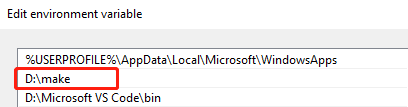
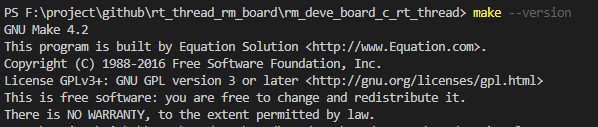
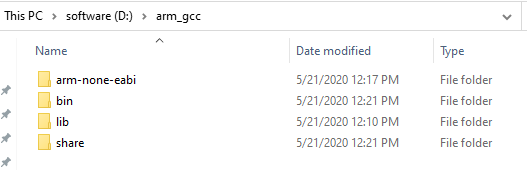
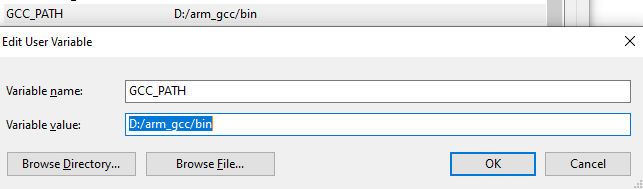

# make与arm-none-eabi-gcc环境搭建

## make工具下载与环境路径配置
在doc/readme/tools里有make rm mkdir工具， 下载放在某个目录下并添加到系统路径path里。 例如放在D:/make目录下

[win10添加环境路径](https://jingyan.baidu.com/article/358570f69e8a13ce4724fcf8.html)

添加系统路径后,重启后在命令行输入 make --version输出

## arm-none-eabi-gcc编译下载与环境变量配置
在官网选择对应平台的arm-none-eabi-gcc编译器下载

[arm-none-eabi-gcc](https://developer.arm.com/tools-and-software/open-source-software/developer-tools/gnu-toolchain/gnu-rm/downloads)

下载解压后 放在某个目录下 例如D:/arm_gcc

在环境变量中添加GCC_PATH变量

